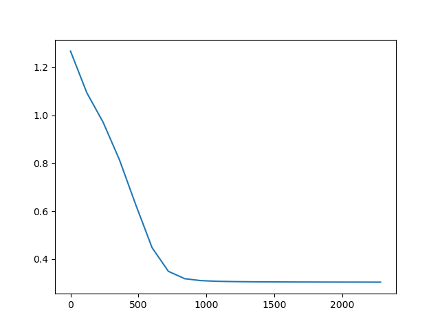
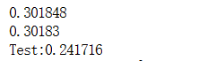
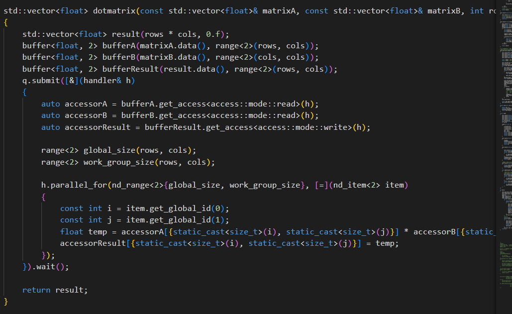
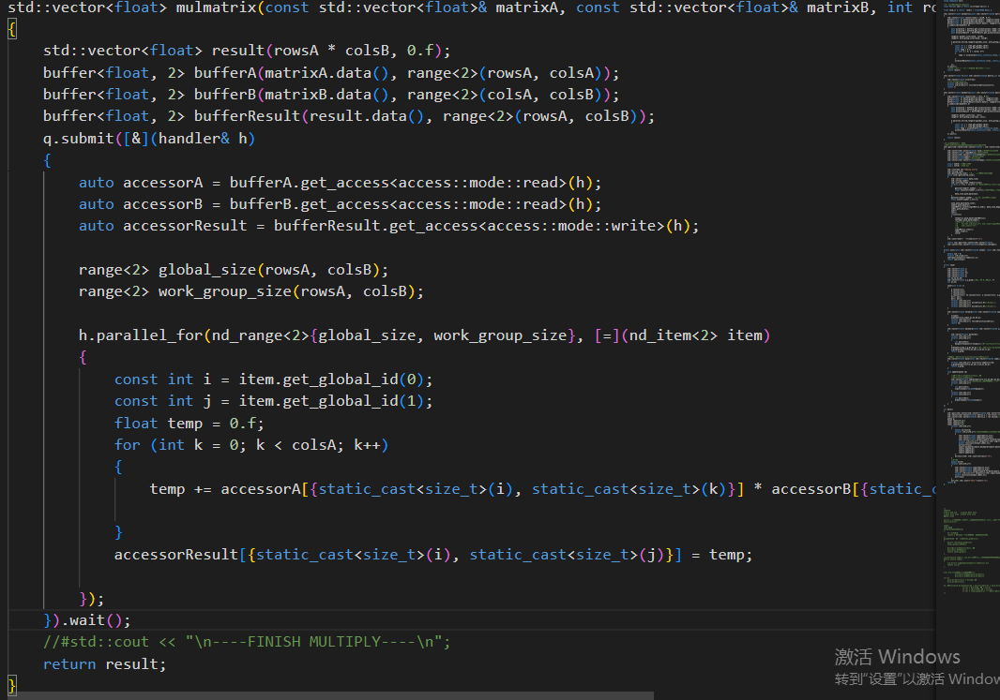

# a-simple-sycl-project
running on intel devcloud，a simple sycl project.
click [here](https://github.com/HJLQZ/a-simple-sycl-project/blob/main/SYCLLearningNotes.md) to see my learning notes.

## 项目概述

本项目使用多层感知机（MLP）算法对葡萄酒口味值进行预测。通过11种特征作为输入，预测葡萄酒的口味值。代码使用SYCL库进行并行计算，加速模型训练过程。

## 实现方案

项目采用多层感知机（MLP）算法，使用SYCL库进行并行计算。代码主要分为以下几个部分：

输入数据处理：从CSV文件中读取葡萄酒特征和标签数据，并进行归一化处理。

多层感知机层定义：定义了三个层，每层包括权重矩阵、偏置矩阵和相关操作函数。

前向传播：通过多层感知机的前向传播计算，将输入特征通过层与层之间的权重和偏置进行线性组合和激活函数处理，得到最终的输出。

反向传播：根据损失函数计算输出与真实标签之间的误差，并通过反向传播将误差传递回每一层，更新权重和偏置。

模型训练：使用训练数据集对模型进行训练，迭代多次进行权重和偏置的更新。

模型评估：使用测试数据集对训练好的模型进行评估，计算平均损失。

## 程序流程

#### 数据处理

从CSV文件中读取葡萄酒的特征和标签数据。特征数据已经预先归一化处理。

#### 多层感知机层定义

多层感知机层定义模块包含三个层：输入层、隐藏层和输出层。每个层都有相关的权重矩阵和偏置矩阵。我们使用SYCL库来实现并行计算，以提高训练过程的效率。

#### **前向传播**

前向传播模块实现了多层感知机的前向传播计算。它通过将输入特征

与权重矩阵相乘，并应用激活函数（这里使用的是sigmoid函数），计算隐藏层和输出层的输出值。

#### **反向传播与参数更新**

反向传播计算网络中各层的误差，并更新权重和偏置。

计算输出层的误差项，使用梯度下降法更新权重和偏置，通过将当前权重和偏置减去学习率乘以梯度得到新的权重和偏置值。

重复以上步骤，直到达到预定的训练迭代次数或达到收敛条件。

#### **模型训练与评估**

在模型训练阶段，数据集大小为120x11。使用输入数据进行多轮迭代的前向传播和反向传播过程，梯度下降法更新模型参数。收敛效果如下：

在模型训练完成后，使用大小为25x11测试集对模型进行评估。测试效果如下：

## SYCL部分

使用sycl进行矩阵叉乘与点乘，加速并行计算

代码如下：

